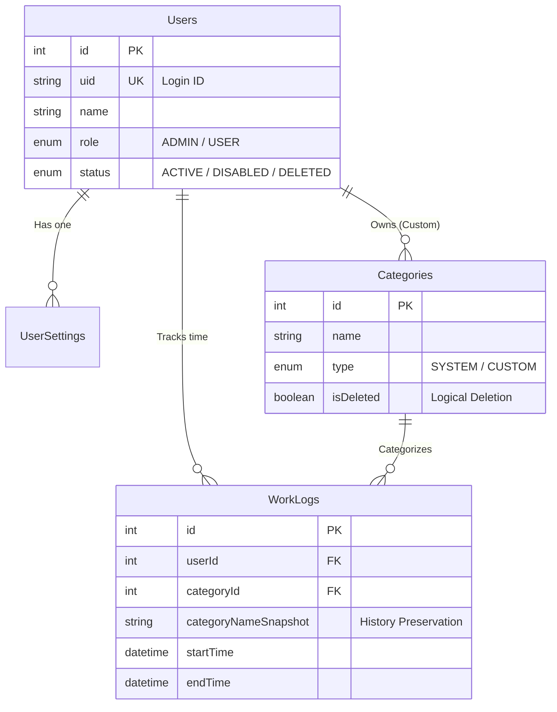

# 業務時間計測Webアプリケーション データベース定義書

## 1. データベース環境構成

| 項目 | 設定値 | 備考 |
| :--- | :--- | :--- |
| **RDBMS** | PostgreSQL 15 以上 | |
| **接続ポート** | `55002` | ホスト側ポートマッピング |
| **データベース名** | `timestudy_db` | (任意) |
| **ユーザー名** | `postgres` | (任意) |
| **パスワード** | `postgres` | (任意) |
| **文字コード** | `UTF-8` | |
| **ORM** | Prisma | アプリケーション層からのアクセスに使用 |

## 2. ER図（概念）

`User` を中心としたリレーショナル構成。
厳格なステータス管理(`UserStatus`)と、履歴改変防止のためのスナップショット設計が特徴。



## 3. テーブル定義詳細

Prismaのモデル定義に基づき、PostgreSQL上に作成される物理テーブルの仕様。

### 3.1 `users` (ユーザーマスタ)
認証・権限・状態管理を行う中核テーブル。

| 論理名 | 物理名 | データ型 | NULL | デフォルト | PK | 備考 |
| :--- | :--- | :--- | :--- | :--- | :--- | :--- |
| ID | `id` | `INTEGER` | **不可** | SERIAL | 〇 | 自動採番 |
| ログインID | `uid` | `TEXT` | **不可** | - | | ユニーク制約 |
| ユーザー名 | `name` | `TEXT` | **不可** | - | | 表示名 |
| 権限 | `role` | `ENUM` | **不可** | 'USER' | | ADMIN / USER |
| ステータス | `status` | `ENUM` | **不可** | 'ACTIVE' | | ACTIVE / DISABLED / DELETED |
| 単価 | `hourlyRate` | `INTEGER` | 可 | 0 | | コスト計算用 |
| 作成日時 | `createdAt` | `TIMESTAMP` | **不可** | NOW | | |
| 更新日時 | `updatedAt` | `TIMESTAMP` | **不可** | - | | |

### 3.2 `categories` (業務項目マスタ)
SYSTEM（全共通）とCUSTOM（個人用）を管理する。論理削除を採用。

| 論理名 | 物理名 | データ型 | NULL | デフォルト | PK | 備考 |
| :--- | :--- | :--- | :--- | :--- | :--- | :--- |
| ID | `id` | `INTEGER` | **不可** | SERIAL | 〇 | 自動採番 |
| カテゴリ名 | `name` | `TEXT` | **不可** | - | | |
| 種別 | `type` | `ENUM` | **不可** | - | | SYSTEM / CUSTOM |
| 作成者ID | `createdById` | `INTEGER` | 可 | - | | FK(users). SYSTEM時はNULL |
| 論理削除 | `isDeleted` | `BOOLEAN` | **不可** | false | | trueなら選択肢に表示しない |
| 表示順 | `priority` | `INTEGER` | **不可** | 0 | | |

### 3.3 `work_logs` (作業ログ)
業務時間の記録。**カテゴリ名のスナップショット保存**が最重要。

| 論理名 | 物理名 | データ型 | NULL | デフォルト | PK | 備考 |
| :--- | :--- | :--- | :--- | :--- | :--- | :--- |
| ID | `id` | `INTEGER` | **不可** | SERIAL | 〇 | 自動採番 |
| ユーザーID | `userId` | `INTEGER` | **不可** | - | | FK(users) |
| カテゴリID | `categoryId` | `INTEGER` | 可 | - | | FK(categories) |
| カテゴリ名(Snap) | `categoryNameSnapshot` | `TEXT` | **不可** | - | | **履歴保存用** |
| 開始日時 | `startTime` | `TIMESTAMP` | **不可** | NOW | | |
| 終了日時 | `endTime` | `TIMESTAMP` | 可 | NULL | | 計測中はNULL |
| 経過時間(秒) | `duration` | `INTEGER` | 可 | NULL | | |

### 3.4 `user_settings` (ユーザー設定)
個人のUI設定などをJSONで保持する。

| 論理名 | 物理名 | データ型 | NULL | デフォルト | PK | 備考 |
| :--- | :--- | :--- | :--- | :--- | :--- | :--- |
| ユーザーID | `userId` | `INTEGER` | **不可** | - | 〇 | FK(users) |
| 設定データ | `preferences` | `JSON` | 可 | - | | ボタン順序、非表示設定など |
| 更新日時 | `updatedAt` | `TIMESTAMP` | **不可** | - | | |

## 4. Prisma Schema (Source of Truth)

実装時は以下のスキーマ定義ファイル (`schema.prisma`) を正とする。

```prisma
datasource db {
  provider = "postgresql"
  url      = env("DATABASE_URL")
}

generator client {
  provider      = "prisma-client-js"
}

// --------------------------------------
// Enums
// --------------------------------------

enum UserStatus {
  ACTIVE   // 通常利用可能
  DISABLED // 無効化 (ログイン不可 / 復帰可能 / 画面はグレーアウト)
  DELETED  // 削除 (ログイン不可 / 復帰不可 / 画面は赤色ロック / データ保持)
}

enum CategoryType {
  SYSTEM // 管理者のみ編集可能 (全共通)
  CUSTOM // 作成したユーザーのみ編集可能 (個人用)
}

enum Role {
  ADMIN // 管理者
  USER  // 一般ユーザー
}

// --------------------------------------
// Models
// --------------------------------------

model User {
  id        Int        @id @default(autoincrement())
  uid       String     @unique // ログインID
  name      String
  role      Role       @default(USER)
  status    UserStatus @default(ACTIVE)
  
  hourlyRate Int?      @default(0)

  createdAt DateTime   @default(now())
  updatedAt DateTime   @updatedAt

  settings   UserSetting?
  logs       WorkLog[]
  categories Category[] // 自分が作成したカテゴリ (Custom)

  @@map("users")
}

model UserSetting {
  userId      Int      @id
  user        User     @relation(fields: [userId], references: [id])
  
  // ボタン順序や非表示設定 (例: { "order": [1, 5], "hidden": [2] })
  preferences Json?    

  updatedAt   DateTime @updatedAt

  @@map("user_settings")
}

model Category {
  id          Int          @id @default(autoincrement())
  name        String       // 現在の業務項目名
  type        CategoryType
  
  // Systemの場合はNULL、Customの場合は作成者ID
  createdById Int?         
  createdBy   User?        @relation(fields: [createdById], references: [id])
  
  isDeleted   Boolean      @default(false) // 論理削除
  priority    Int          @default(0)     // 表示順序

  logs        WorkLog[]

  @@map("categories")
}

model WorkLog {
  id          Int       @id @default(autoincrement())
  userId      Int
  user        User      @relation(fields: [userId], references: [id])
  
  // マスタ参照 (マスタ削除後もID維持)
  categoryId  Int?      
  category    Category? @relation(fields: [categoryId], references: [id])

  // ★重要: スナップショット
  // ログ作成時点の Category.name をコピー保存する。
  categoryNameSnapshot String 

  startTime   DateTime  @default(now())
  endTime     DateTime?
  duration    Int?      // 秒 (endTime - startTime)

  createdAt   DateTime  @default(now())

  @@index([userId, startTime])
  @@map("work_logs")
}
```

## 5. Docker Compose 定義

```yaml
version: '3.8'

services:
  db:
    image: postgres:15-alpine
    container_name: zimmeter-db
    ports:
      - "55002:5432"
    environment:
      POSTGRES_USER: user
      POSTGRES_PASSWORD: password
      POSTGRES_DB: zimmeter
    volumes:
      - postgres_data:/var/lib/postgresql/data
# ... (server/client omitted)
```
